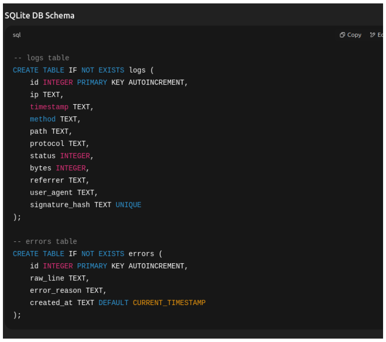

# 📊 LogForge Apache Log ETL

## 📁 Overview
LogForge is an Apache log parser and analyzer pipeline that extracts, parses, stores, and summarizes log data using Python and SQLite.

---

## ⚙️ Project Structure

- `etl_apache.py` – CLI runner for the ETL pipeline
- `parser.py` – Parses raw log lines using regex
- `database.py` – Manages DB schema, connection, and insert logic
- `summerizer.py` – Generates daily summary CSVs
- `apache_logs.db` – Local SQLite DB
- `data/logs/apache_logs` – Folder containing raw logs

---

## 🔍 Schema


## 🚀 Usage

```bash
python etl_apache.py --log data/logs/apache_logs
